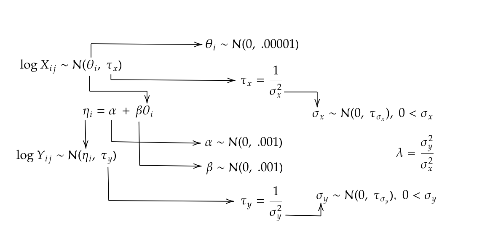
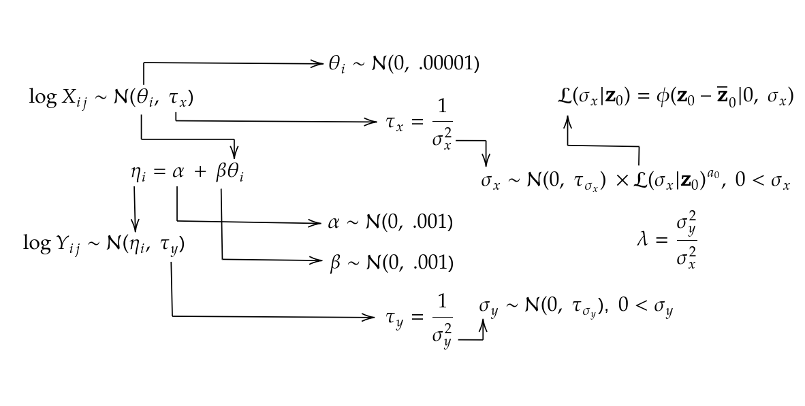
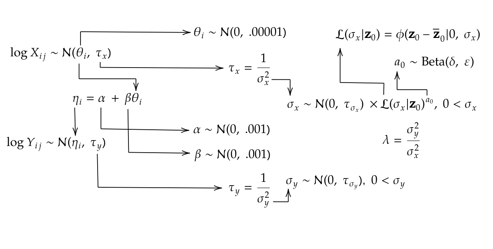

```{r, include = FALSE}
knitr::opts_chunk$set(
  collapse = TRUE,
  echo = FALSE,
  message = FALSE,
  comment = "#>"
)
```

```{css}
img {
  border: 0px;
  width: 100%;
}
```

```{r setup}
library("BayesDeming")
```

TODO:

- Remove logs from diagrams
- Reparameterize in terms of sd, not precision
- Add relevant hyper priors
- Add indeces (i = 1, ..., K; j = 1, ..., Jx_i/Jy_i)
- Add lambda as transformed parameter in stan code

# Standard Deming regression

```{stan, file='../inst/stan/deming.stan', output.var = "temp", echo = TRUE, eval = FALSE, class.source = 'fold-hide'}

```

<br></br>
<br></br>

# Deming regression incorporating prior data


```{stan, file='../inst/stan/deming_power.stan', output.var = "temp", echo = TRUE, eval = FALSE, class.source = 'fold-hide'}

```

<br></br>

## Hyper prior


```{stan, file='../inst/stan/deming_power_beta.stan', output.var = "temp", echo = TRUE, eval = FALSE, class.source = 'fold-hide'}

```


```{stan, file='../inst/stan/deming_power_normal.stan', output.var = "temp", echo = TRUE, eval = FALSE, class.source = 'fold-hide'}

```
